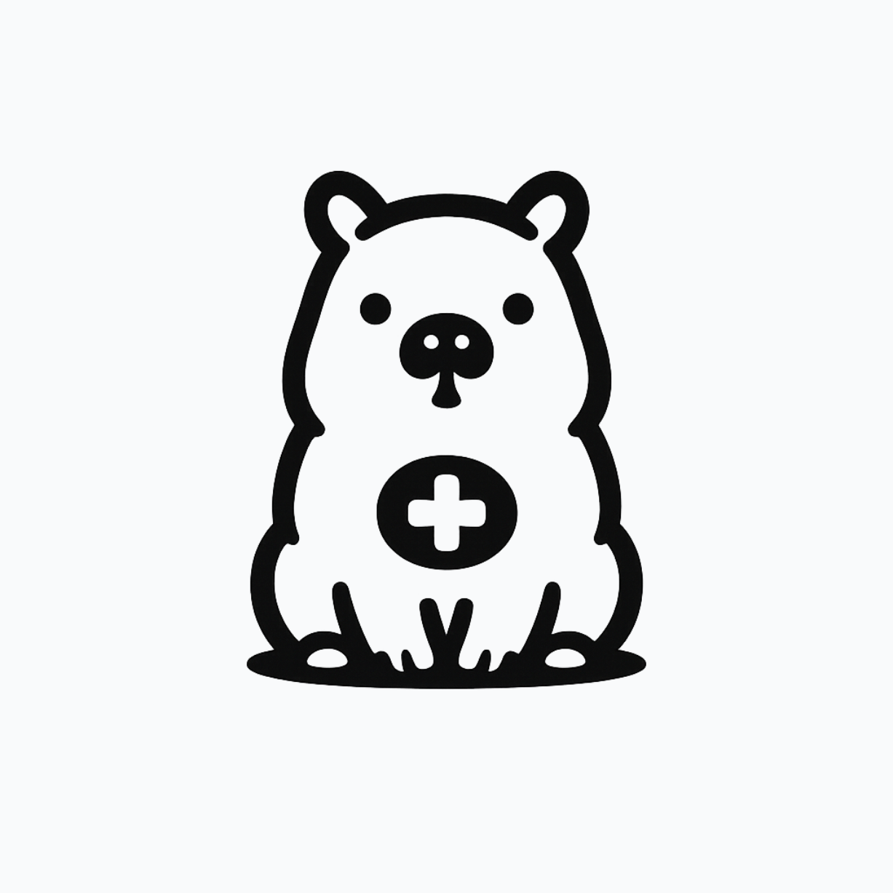

  
  <h1>Kapi - Asistente Médico Local</h1>
  

    
  

  
<em>Offline AI healthcare assistant powered by local LLMs, multimodal agents, and medical RAG.</em>

## 🩺 ¿Qué es Kapi?

**Kapi** es un asistente médico local impulsado por Inteligencia Artificial diseñado para brindar asesoría y seguimiento continuo a pacientes. A través de un sistema RAG (Retrieval-Augmented Generation) que consulta documentos médicos base, Kapi analiza los casos, ofrece sugerencias guiadas y mantiene un registro clínico integral.

## 🎯 Propósito y Alcance

> ⚠️ **Importante:** Kapi **NO** reemplaza a un doctor o profesional de la salud.

Su misión principal es servir como una herramienta de apoyo vital para pacientes en **zonas de difícil acceso**, donde las visitas de médicos o especialistas son escasas. 

Kapi busca cerrar la brecha de atención mediante:
- 📝 **Guía y seguimiento básico**: Acompañamiento continuo sobre los síntomas y evolución de los pacientes en el día a día.
- 🚨 **Generación de alertas**: Si el paciente presenta un cuadro clínico preocupante durante el seguimiento, Kapi emite alertas preventivas.
- 👨‍⚕️ **Soporte al especialista**: Registra y compila toda la información de seguimiento en un historial descargable. De esta forma, cuando el doctor visite la comunidad o el paciente acceda a un centro de salud, el profesional cuenta con un registro detallado para evaluar y emitir un diagnóstico preciso.

## 🛠️ Tecnologías
- **Modelos LLM 100% Locales** (Ollama, Llama.cpp) para garantizar la privacidad y el funcionamiento sin internet.
- **RAG Médico** (ChromaDB + SentenceTransformers).
- **Agentes AI** para el análisis y flujo de decisiones clínicas.
